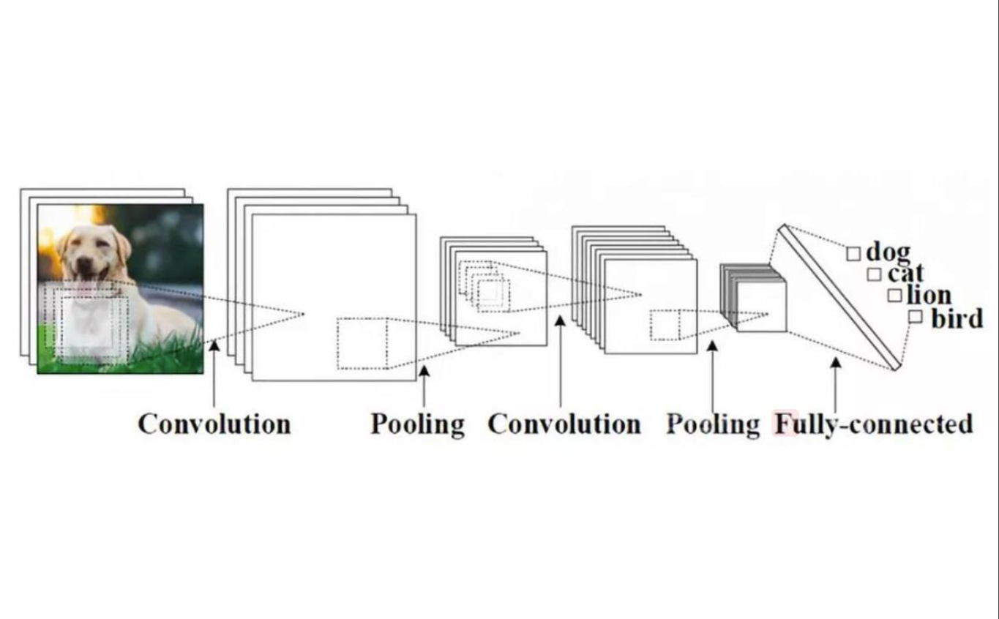
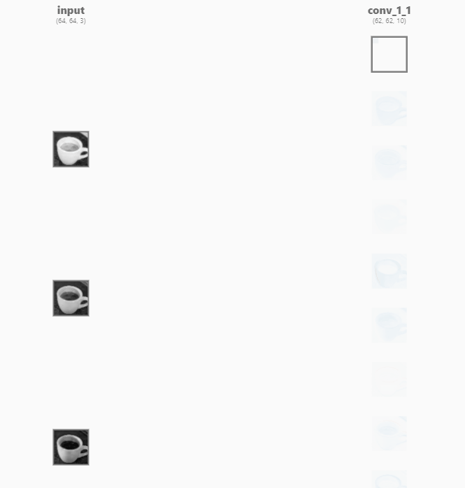

# CS205 C/ C++ Programming - SimpleCNNonCPP

> This cnn model on cpp can detect whether the input image is a person

* __Name__: 刘仁杰(Liu Renjie)
* __SID__: 11911808
* __Code Storage Location: [GitHub Repository](https://github.com/Liu-rj/SimpleCNNonCPP)

## Part 1 - Analysis

> This part provides the basic concept of CNN(Convolutional Neural Network), from convlutional layer to softmax layer, and demonstrate how they work seperately and coherently.

### What is CNN?

In the above picture we can see that a cnn can distinguish what kind of animals the input picture is through a sequence of convlution, BN,Relu ,pooling and fullconnect operations. Here in this assignment we are implementing a cnn that can tell whether the input image is a person or not. __In our cnn model, BN and Relu are integrated into conv layer, also, we only implement the forward-propagating part.__

### Basic Model of CNN

* #### ConvBNRelu layer

The above convolution step is the fisrt layer processing the input image as a cup. It can be easily seen that input image has three channels, each channel reflects a different color gamut. And for different channels, there are different kernel functioning as a sliding window. Let's look deeper into how this sliding window actually work.

In this example, kernel size is 3*3, scanning from the __upper left corner__ down to the __lower right corner__.
In every sliding window, elements in the kernel __multiplies__ with coressponding elements of input image matrix, multiplication result plus a __bias__ value gets one element of convolutional output image matrix in the coressponding image.

##### Notice that before really doing the convolution, we need to handle with two constrains. One is __padding__, the other is __stride__.

* padding: pad several laps of zero to original input image.

But why we should do padding?

> 1. The matrix after convolution gets smaller and smaller (if the convolution layer is 100 layers, each layer shrinks, and the final image will be very small)
> 2. The input matrix edge pixel is computed only once, while the middle pixel (red shadow) is convolved many times, which means that the corner information of the image is lost.

**Through padding, we can solve the size shrinking problem and also Convolution check edge information is processed more than once, therefore the edge information is more fully extracted.**

* stride: the length we slide while processing convolution.

> for example: if the stride is 2, every sliding we move two grid to the next convolution field. so the output size will certainly shrink by 2.

__Until now, we can find a general term formula for the output size of Convolution Layer. It can be discribed as__

$$
output dimension = \frac{input dimension + 2* pad - kernel size}{stride}+1 \tag{1}
$$

Moreover, every kernel outputs a 2D plane of matrix, which means that the number of kernel determines the output channels after __ConvBNRelu Layer__.
And the __Relu__ step is just to erase negative value and set it to zero.

It's worth noticing that there are many ways to optimize convolution step, such as __im2col + GEMM__, __FFT(Fast Fourier Transforms)__ and __Winograd__. More details will be mentioned below.

* #### MaxPool Layer

In this step here we will just do the max pool, and the fliter size is constrained to 2*2.

Why we do maxpool?

> * reduce model size and so increase computing speed.
> *  further extract model information, strengthen the robustness of the extracted feature.

The above formula$(1)$ can also discribe output model feature of MaxPool Layer.

* #### Flatten Layer

The aim of Flatten Layer is flattening the 2D or 3D model to one dimension which has continous memory access. Since we already store our original input image in __one dimensional array__, so in this step, there is nothing left for us to do.

* #### Full Connect Layer

After Flatten Layer, we got a one-dimensional vector of feature. In Full Connect Layer, we do multiplication to this vector with our training data, reduce its dimension and send the result to SoftMax Layer to get the confidence score of each type.

The FC operation can be discribed by the following formula:

$$
Output=weight*input+bias \tag{2}
$$

* #### SoftMax Layer

In the nearly-end layer of CNN, "soft" operation will be implemented to the input feature.

Let's first see how "soft" works through inner formula:

$$
\begin{array}{l}
for \ x \in \mathbb{R}^{n} \quad
p_{i}=\frac{e^{x_{i}}}{\sum_{j=1}^{n} e^{x_{j}}} \quad p=\left(\begin{array}{c}
p_{1} \\
\vdots \\
p_{n}
\end{array}\right)
\end{array}
\tag{3}
$$

In this cnn model, $n=2$, means that we will get 2 output ranging from 0~1, representing probability of each type. Here $p_{1}$ represents for the confidence score of person while $p_{2}$ stands for the background.

## Part 2 - Implementation