<script type="text/javascript" src="http://cdn.mathjax.org/mathjax/latest/MathJax.js?config=TeX-AMS-MML_HTMLorMML"></script>
<script type="text/x-mathjax-config">
    MathJax.Hub.Config({ tex2jax: {inlineMath: [['$', '$']]}, messageStyle: "none" });
</script>

# CS205 C/ C++ Programming - SimpleCNNonCPP

> This cnn model on cpp can detect whether the input image is a person

* __Name__: 刘仁杰(Liu Renjie)
* __SID__: 11911808
* __Code Storage Location: [GitHub Repository](https://github.com/Liu-rj/SimpleCNNonCPP)

## Part 1 - Analysis

> This part provides the basic concept of CNN(Convolutional Neural Network), from convlutional layer to softmax layer, and demonstrate how they work seperately and coherently.

### Something to be declared

__In our cnn model, BN and Relu are integrated into conv layer, also, we only implement the forward-propagating part__. Training data provided by Prof.Shiqi Yu can be found in __facedetection.cpp__. Also, Due to the training data, this model can only detect image with size __128*128*3__. However, __this forward-propagating part is written in a general form and can be used in any cnn model as long as fitted with the right backward-propagating training data__.

### Basic Model of CNN

* #### ConvBNRelu layer

<div align="center">
	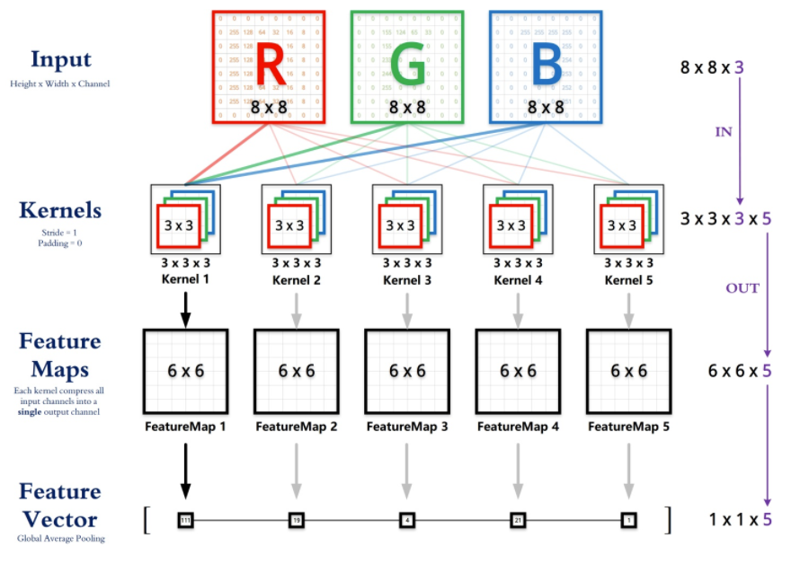
</div>

The above convolution step is the first layer processing the input image. It can be easily seen that input image has three channels RGB, each channel reflects a different color gamut. And for different channels, there are different kernel functioning as a sliding window. Let's look deeper into how this sliding window actually work.

<div align="center">
	
</div>

In this example, kernel size is 3*3, scanning from the __upper left corner__ down to the __lower right corner__.
In every sliding window, elements in the kernel __multiplies__ with coressponding elements of input image matrix, multiplication result plus a __bias__ value gets one element of convolutional output image matrix in the coressponding image.

##### Notice that before really doing the convolution, we need to handle with two constrains. One is __padding__, the other is __stride__.

* padding: pad several laps of zero to original input image.

<div align="center">
	
</div>

But why we should do padding?

> 1. The matrix after convolution gets smaller and smaller (if the convolution layer is 100 layers, each layer shrinks, and the final image will be very small)
> 2. The input matrix edge pixel is computed only once, while the middle pixel (red shadow) is convolved many times, which means that the corner information of the image is lost.

**Through padding, we can solve the size shrinking problem and also Convolution check edge information is processed more than once, therefore the edge information is more fully extracted.**

* stride: the length we slide while processing convolution.

<div align="center">
	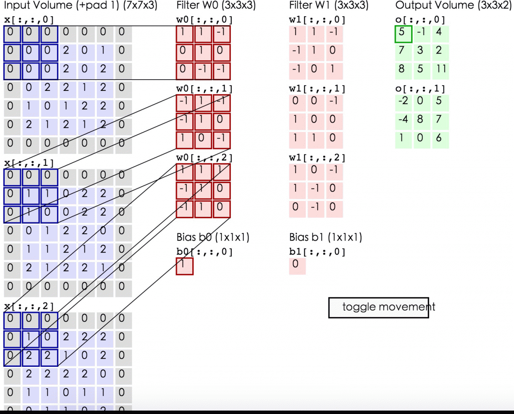
</div>

> for example: if the stride is 2, every sliding we move two grid to the next convolution field. so the output size will certainly shrink by 2.

__Until now, we can find a general term formula for the output size of Convolution Layer. It can be discribed as__

$$
\left\{\begin{array}{l}
\text {height}_{\text {out}}=\left(\text {height}_{\text {in}}-\text {height}_{\text {kernel}}+2 * \text {padding}\right) / \text {stride}+1 \\
\text {width}_{\text {out}}=\left(\text {width}_{\text {in}}-\text {width}_{\text {kernel}}+2 * \text {padding}\right) / \text {stride}+1
\end{array}\right. \tag{1}
$$

Moreover, every kernel outputs a 2D plane of matrix, which means that the number of kernel determines the output channels after __ConvBNRelu Layer__.
And the __Relu__ step is just to erase negative value and set it to zero.

It's worth noticing that there are many ways to optimize convolution step, such as __im2col + GEMM__, __FFT(Fast Fourier Transforms)__ and __Winograd__. More details will be mentioned below.

* #### MaxPool Layer

<div align="center">
	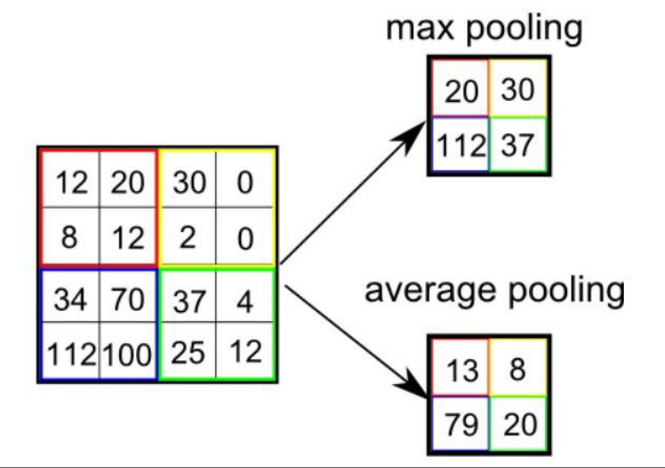
</div>

In this step here we will just do the max pool, and the fliter size is constrained to 2*2.

Why we do maxpool?

> * reduce model size and so increase computing speed.
> *  further extract model information, strengthen the robustness of the extracted feature.

The above formula$(1)$ can also discribe output model feature of MaxPool Layer.

* #### Flatten Layer

The aim of Flatten Layer is flattening the 2D or 3D model to one dimension which has continous memory access. Since we already store our original input image in __one dimensional array__, so in this step, there is nothing left for us to do.

* #### Full Connect Layer

<div align="center">
	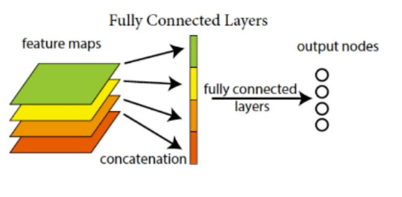
</div>

After Flatten Layer, we got a one-dimensional vector of feature. In Full Connect Layer, we do multiplication to this vector with our training data, reduce its dimension and send the result to SoftMax Layer to get the confidence score of each type.

The FC operation can be discribed by the following formula:

$$
Output=weight*input+bias \tag{2}
$$

* #### SoftMax Layer

In the nearly-end layer of CNN, "soft" operation will be implemented to the input feature.

Let's first see how "soft" works through inner formula:

$$
\begin{array}{l}
for \ x \in \mathbb{R}^{n} \quad
p_{i}=\frac{e^{x_{i}}}{\sum_{j=1}^{n} e^{x_{j}}} \quad p=\left(\begin{array}{c}
p_{1} \\
\vdots \\
p_{n}
\end{array}\right)
\end{array}
\tag{3}
$$

In this cnn model, $n=2$, means that we will get 2 output ranging from 0~1, representing probability of each type. Here $p_{1}$ represents for the confidence score of person while $p_{2}$ stands for the background.

## Part 2 - Implementation - Brutal Force

> This part provide the basic implementation of cnn.
> __Continous cache is considered in all steps in this Brutal Force model, although it's called "brutal", it's much faster than a real brutal force cnn because of continious memory access!__

* ### Before CNN

Before the first ConvBNReLU layer, we need to get the image information for our cnn model, here we use opencv to convert the input 3-channel-image to a 2D array ranging from 0~255 BGR through following operation:

```c++
Mat m = imread("./pics/face.jpg");
Mat image;
m.convertTo(image, CV_32FC3);
```

Than we convert this 2D BGR array into a 1D-RGB-float-array ranging from 0~1 through function "convertRGB" wich can be found in __facedetetion\facedetection.cpp__.

And we call this function surrounding with a try catch to prevent unexpected shutdown:

```c++
try
{
	img = convertRGB(image);
}
catch (const char* e)
{
	cout << e << endl;
}
```

Moreover, we will use a clock for timing:

```c++
auto start = std::chrono::steady_clock::now();
try
{
	result = cnn(img, m.rows, m.cols, m.channels());
}
catch (const char* e)
{
	cout << e << endl;
	exit(0);
}
auto end = std::chrono::steady_clock::now();
```

* ### ConvBNReLU Layer

#### first we do the padding

Implementation of padding can be found in __facedetection\facedetection.cpp__.

```c++
float* convertRGB(Mat img);
```

Rather than regurgitating, detailed explanation of padding operation has been mentioned above.

#### How we do conv in brutal force

Through it's the brutal force, to make a general general model, here we learn from __im2col algorithm__ to implement conv by __vector dot product__ form rather than __matrix multiplication__, further optimization by matrix multiplication will be discussed later.

```c++
// im2col algorithm flatten by plane RRRGGGBBB
float* im2col_plane(float* newimg, int newrows, int newcols, int convrows, int convcols, int channels, int kernel_size, int stride)
{
	int newsize = newrows * newcols;
	float* result = new float[kernel_size * kernel_size * convrows * convcols * channels];
	int index = -1;
	for (int g = 0; g < channels; g++) // RGB
	{
		int position = g * newsize - 1; // initial position
		for (int i = 0; i < convrows; i++)
		{
			for (int j = 0; j < convcols; j++)
			{
				int colp = position + j * stride;
				for (int k = 0; k < kernel_size; k++) // rows
				{
					int kp = colp + k * newcols; // column position
					for (int l = 0; l < kernel_size; l++) // cols
					{
						result[++index] = newimg[++kp];
					}
				}
			}
			position += newcols * stride; // rows position
		}
	}
	return result;
}
```

Notice that we flatten the image plane by plane, that is to say, when one in_channel of the kernel is sliding on one channel of our input image, output what's in this sliding window in line until one channel is completely scanned. Thus, output 1D array should be in RRRGGGBBB form. This is also why we do vector dot product rather than matrix multiplication.

__Our main optimization will also be in conv layer__.

The first version of ConvBNRelu is shown as following:

```c++
// convolution & BN & Relu
float* ConvBNReLU(float* img, int rows, int cols, int channels, conv_param& cp)
{
	int convrows = (rows - cp.kernel_size + 2 * cp.pad) / cp.stride + 1; // rows after convolution
	int convcols = (cols - cp.kernel_size + 2 * cp.pad) / cp.stride + 1; // columns after convolution
	int kerneltimes = convrows * convcols;
	int kernelsize = cp.kernel_size * cp.kernel_size;
	float* newimg = paddling(img, rows + 2 * cp.pad, cols + 2 * cp.pad, channels, cp.pad);
	float* imgcol = im2col_plane(newimg, rows + 2 * cp.pad, cols + 2 * cp.pad, convrows, convcols, channels, cp.kernel_size, cp.stride);
	delete[] newimg;
	float* conv = new float[kerneltimes * cp.out_channels] {}; // size after convolution 64 * 64 * 16
	int key = -1, index = -1, kernelindex = 0;
	
	for (int i = 0; i < cp.out_channels; i++)
	{
		for (int j = 0; j < cp.in_channels; j++)
		{
			for (int k = 0; k < kerneltimes; k++)
			{
				++index;
				for (int l = 0; l < kernelsize; l++)
				{
					conv[index] += imgcol[++key] * cp.p_weight[kernelindex + l];
				}
			}

			index -= kerneltimes;

			if (j == cp.in_channels - 1)
			{
				for (int k = 0; k < kerneltimes; k++)
				{
					conv[++index] += cp.p_bias[kernelindex / (kernelsize * cp.in_channels)];

					// Rectified Linear Unit
					if (conv[index] < 0)
					{
						conv[index] = 0;
					}
				}
			}
			kernelindex += kernelsize;
		}
		key = -1;
	}
	delete[] imgcol;
	return conv;
}
```

* ### MaxPool Layer

Implementation of MaxPool can be found in __facedetection\facedetection.cpp__.

```c++
float* MaxPooling(float* img, int convrows, int convcols, int channels);
```

* ### FullConnect Layer

Implementation of FullConnect can be found in __facedetection\facedetection.cpp__.

```c++
float* FullConnect(float* img, int rows, int cols, int channels, fc_param& fc);
```

* ### SoftMax Layer

Implementation of SoftMax can be found in __facedetection\facedetection.cpp__.

```c++
void SoftMax(float* fcl, int size);
```

* ### a integrated function provide for user input

In this function, any exception thrown by bottom implementation will be thrown to external user main function.

Implementation of __cnn__ can be found in __facedetection\facedetection.cpp__.

```c++
float* cnn(float* img, int rows, int cols, int channels);
```

* ### How we call this CNN?

Very simple! Just a 1D float array is needed to receive the data after a complete cnn! If any error occurs, it will also be caught for reminding!

```c++
try
{
	result = cnn(img, m.rows, m.cols, m.channels());
}
catch (const char* e)
{
	cout << e << endl;
	exit(0);
}
```

* ### Accuracy and efficiency Test

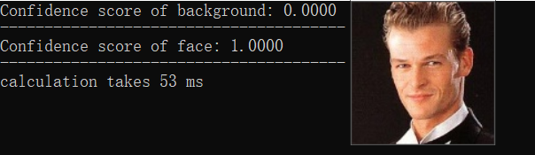

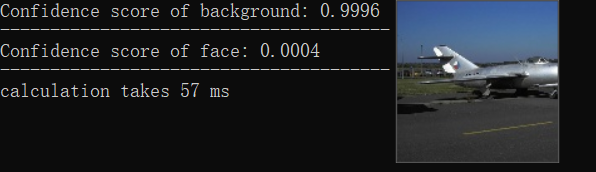

Can be seen from the pics above, our cnn result meets our expetation.

Here we test each picture in the same configuration and get their average of __55ms per pic__.

## Optimization

> There are many subtle and effecient optimization algorithms for accelerating cnn especially convolution and fullconnect layer including __im2col + GEMM(Image to Column + GEneral Matrix Mutiplication), FFT(Fast Fourier Transforms) and winograd(fast convolution)__. However, due to time limit, there are not enough time for us to try every algorithm, here we will just talk about im2col + GEMM __on the basis of our work in midterm project__.

* ### The idea of im2col + GEMM

The idea of im2col is to flatten our multichannel image into a 1D array by columns. Every row have one sliding window in every channel.

So the size of feature matrix flattened from original input image can be discribed as:

$$
\left\{\begin{array}{l}
\text {rows}=\text {height}_{\text {out}} * \text {width}_{\text {out}} \\
\text {columns}=\text {kernelsize}*\text {kernelsize}* \text {channels}
\end{array}\right. \tag{4}
$$

In the above formula, $\text {height}_{\text {out}}$ and $\text {width}_{\text {out}}$ can be found in $(1)$, $kernelsize$ represents for the side length of kernel, $channels$ represents for the channels of input array.

Following will further demonstrate on how im2col works:

<div align="center">
	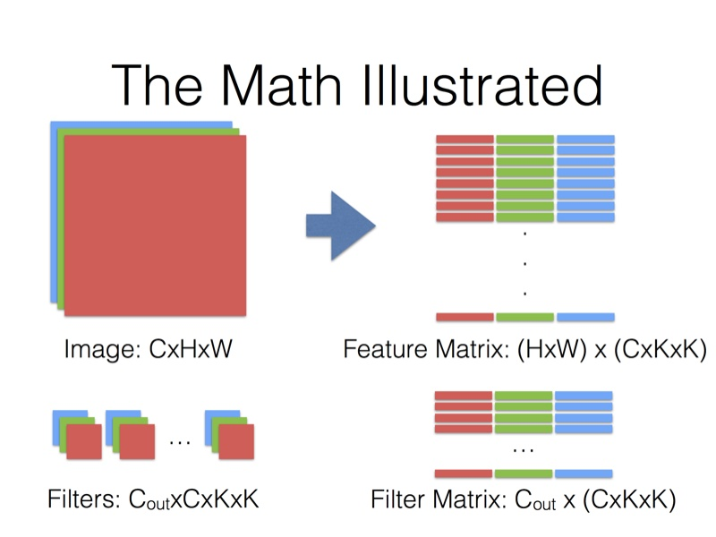
</div>


Then we just need to do GEMM between feature matrix and filter matrix. __Notice that before doing matrix multiplication, we need to transpose filter matrix since it's originally stored by plane rather than by channel__.

__Also, after GEMM, the output marix is store by out_channel of fliter matrix ranther than plane by plane. That is to say, we also need to do a transpose to output matrix.

My source code of implementing im2col + GEMM is atteched below:

* im2col:

```c++
// im2col algorithm flatten by channel RGBRGBRGB
float* im2col_channel(float* newimg, int newrows, int newcols, int convrows, int convcols, int channels, int kernel_size, int stride)
{
	int newsize = newrows * newcols;
	float* result = new float[kernel_size * kernel_size * convrows * convcols * channels];
	int index = -1, position = -1;
	for (int i = 0; i < convrows; i++)
	{
		for (int j = 0; j < convcols; j++)
		{
			int colp = position + j * stride; // column initial position
			for (int g = 0; g < channels; g++)
			{
				int kp = colp + g * newsize;
				for (int k = 0; k < kernel_size; k++) // rows
				{
					for (int l = 0; l < kernel_size; l++) // cols
					{
						result[++index] = newimg[++kp];
					}
					kp += newcols - kernel_size; // column position
				}
			}
		}
		position += newcols * stride; // rows position
	}
	return result;
}
```

* conv:

```c++
// convolution & BN & Relu
float* ConvBNReLU_gemm(float* img, int rows, int cols, int channels, conv_param& cp)
{
	...
	float* imgcol = im2col_channel(newimg, rows + 2 * cp.pad, cols + 2 * cp.pad, convrows, convcols, channels, cp.kernel_size, cp.stride);
	delete[] newimg;
	float* convtemp = new float[kerneltimes * cp.out_channels]{}; // size after convolution 64 * 64 * 16
	float* conv = new float[kerneltimes * cp.out_channels]{};
	float* rvkernel = new float[kernelsize * cp.out_channels * cp.in_channels]; // transposition of kernel

	transpose(rvkernel, cp.p_weight, cp.out_channels, kernelsize * cp.in_channels);
	m_product_row(convtemp, imgcol, rvkernel, kerneltimes, channels * kernelsize, cp.out_channels);
	//cblas_sgemm(CblasRowMajor, CblasNoTrans, CblasNoTrans, kerneltimes, cp.out_channels, channels * kernelsize, 1, imgcol, channels * kernelsize, rvkernel, cp.out_channels, 0, convtemp, cp.out_channels);
	
	transpose(conv, convtemp, kerneltimes, cp.out_channels);

	// Relu
	int index = -1;
	for (int i = 0; i < cp.out_channels; ++i)
	{
		for (int j = 0; j < kerneltimes; ++j)
		{
			conv[++index] += cp.p_bias[i];
			if (conv[index] < 0)
			{
				conv[index] = 0;
			}
		}
	}

	delete[] imgcol;
	delete[] rvkernel;
	delete[] convtemp;
	return conv;
}
```

* a simple gemm computing by row(__continuous ache, simple but efficient!__):

```c++
void m_product_row(float* c, const float* a, const float* b, int row1, int column1, int column2) {
    int apos = 0;
    int bpos;
    int cpos = 0;
    for (int i = 0; i < row1; ++i) {
        bpos = 0;
        for (int j = 0; j < column1; ++j) {
            for (int k = 0; k < column2; ++k) {
                c[cpos++] += a[apos] * b[bpos++];
            }
            apos++;
            cpos -= column2;
        }
        cpos += column2;
    }
}
```

* Also, my transpose funtion:

```c++
void transpose(float* b, const float* a, int row, int column)
{
    int apos;
    int bpos = -1;
    int num = 0;
    for (int i = 0; i < column; i++)
    {
        apos = i;
        for (int j = 0; j < row; j++)
        {
            b[++bpos] = a[apos];
            apos += column;
        }
    }
}
```

#### Test with first version of im2col + GEMM

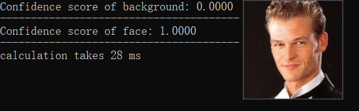

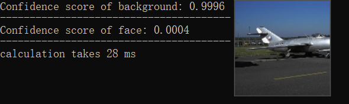

Can be seen from the pics above, our cnn result meets our expetation.

Here we test each picture in the same configuration and get their average of __28ms per pic__. Efficiency nearly __doubled__!

__Since GEMM optimization has been implemented in midterm project, so here we are not going deep, we will just use OpenBLAS to get the best efficiency__.

* ### Test with OpenBLAS

```c++
cblas_sgemm(CblasRowMajor, CblasNoTrans, CblasNoTrans, kerneltimes, cp.out_channels, channels * kernelsize, 1, imgcol, channels * kernelsize, rvkernel, cp.out_channels, 0, convtemp, cp.out_channels);
```

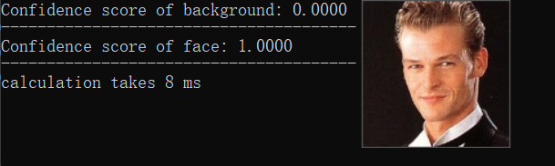

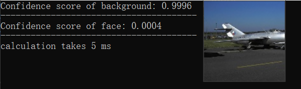

Can be seen from the pics above, our cnn result meets our expetation.

Here we test each picture in the same configuration and get their average of __7ms per pic__. Speed up by nearly __eight times__ than original brutal force!

* ### Conclusion

There are many other remarkable algorithm for speeding up cnn such as FFT and Winograd, but due to time limit, we are not going to talk about them now, maybe later in my spare time I will continue to add some.

## ARM

> This part provide arm test on Raspberry Pi

## Conclusions

> If you are insterested in my work, fork me!

In this project we implement a simple cnn by cpp, made some optimization, and test them on efficiency.

|  method   | time cost |
|  :----:  | :----:  |
| brutal_force  | 55 ms |
| im2col + simplegemm  | 27 ms |
| im2col + OpenBLAS  | 7 ms |

The above is the all of this report. Although this is just an assignment, it will continue to be expanded and optimized in the future, hoping to become a gradually mature cnn model.
__Thanks for watching!__