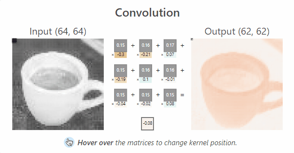

# CS205 C/ C++ Programming - SimpleCNNonCPP

> This cnn model on cpp can detect whether the input image is a person

* __Name__: 刘仁杰(Liu Renjie)
* __SID__: 11911808
* __Code Storage Location: [GitHub Repository](https://github.com/Liu-rj/SimpleCNNonCPP)

## Part 1 - Analysis

> This part provides the basic concept of CNN(Convolutional Neural Network), from convlutional layer to softmax layer, and demonstrate how they work seperately and coherently.

### Something to be declared

__In our cnn model, BN and Relu are integrated into conv layer, also, we only implement the forward-propagating part__. Training data provided by Prof.Shiqi Yu can be found in __facedetection.cpp__. Also, Due to the training data, this model can only detect image with size __128*128*3__. However, __this forward-propagating part is written in a general form and can be used in any cnn model as long as fitted with the right backward-propagating training data__.

### Basic Model of CNN

* #### ConvBNRelu layer

<div align="center">
	
</div>

The above convolution step is the first layer processing the input image. It can be easily seen that input image has three channels RGB, each channel reflects a different color gamut. And for different channels, there are different kernel functioning as a sliding window. Let's look deeper into how this sliding window actually work.

<div align="center">
	
</div>

In this example, kernel size is 3*3, scanning from the __upper left corner__ down to the __lower right corner__.
In every sliding window, elements in the kernel __multiplies__ with coressponding elements of input image matrix, multiplication result plus a __bias__ value gets one element of convolutional output image matrix in the coressponding image.

##### Notice that before really doing the convolution, we need to handle with two constrains. One is __padding__, the other is __stride__.

* padding: pad several laps of zero to original input image.

<div align="center">
	
</div>

But why we should do padding?

> 1. The matrix after convolution gets smaller and smaller (if the convolution layer is 100 layers, each layer shrinks, and the final image will be very small)
> 2. The input matrix edge pixel is computed only once, while the middle pixel (red shadow) is convolved many times, which means that the corner information of the image is lost.

**Through padding, we can solve the size shrinking problem and also Convolution check edge information is processed more than once, therefore the edge information is more fully extracted.**

* stride: the length we slide while processing convolution.

<div align="center">
	
</div>

> for example: if the stride is 2, every sliding we move two grid to the next convolution field. so the output size will certainly shrink by 2.

__Until now, we can find a general term formula for the output size of Convolution Layer. It can be discribed as__

$$
\left\{\begin{array}{l}
\text {height}_{\text {out}}=\left(\text {height}_{\text {in}}-\text {height}_{\text {kernel}}+2 * \text {padding}\right) / \text {stride}+1 \\
\text {width}_{\text {out}}=\left(\text {width}_{\text {in}}-\text {width}_{\text {kernel}}+2 * \text {padding}\right) / \text {stride}+1
\end{array}\right. \tag{1}
$$

Moreover, every kernel outputs a 2D plane of matrix, which means that the number of kernel determines the output channels after __ConvBNRelu Layer__.
And the __Relu__ step is just to erase negative value and set it to zero.

It's worth noticing that there are many ways to optimize convolution step, such as __im2col + GEMM__, __FFT(Fast Fourier Transforms)__ and __Winograd__. More details will be mentioned below.

* #### MaxPool Layer

<div align="center">
	
</div>

In this step here we will just do the max pool, and the fliter size is constrained to 2*2.

Why we do maxpool?

> * reduce model size and so increase computing speed.
> *  further extract model information, strengthen the robustness of the extracted feature.

The above formula$(1)$ can also discribe output model feature of MaxPool Layer.

* #### Flatten Layer

The aim of Flatten Layer is flattening the 2D or 3D model to one dimension which has continous memory access. Since we already store our original input image in __one dimensional array__, so in this step, there is nothing left for us to do.

* #### Full Connect Layer

<div align="center">
	
</div>

After Flatten Layer, we got a one-dimensional vector of feature. In Full Connect Layer, we do multiplication to this vector with our training data, reduce its dimension and send the result to SoftMax Layer to get the confidence score of each type.

The FC operation can be discribed by the following formula:

$$
Output=weight*input+bias \tag{2}
$$

* #### SoftMax Layer

In the nearly-end layer of CNN, "soft" operation will be implemented to the input feature.

Let's first see how "soft" works through inner formula:

$$
\begin{array}{l}
for \ x \in \mathbb{R}^{n} \quad
p_{i}=\frac{e^{x_{i}}}{\sum_{j=1}^{n} e^{x_{j}}} \quad p=\left(\begin{array}{c}
p_{1} \\
\vdots \\
p_{n}
\end{array}\right)
\end{array}
\tag{3}
$$

In this cnn model, $n=2$, means that we will get 2 output ranging from 0~1, representing probability of each type. Here $p_{1}$ represents for the confidence score of person while $p_{2}$ stands for the background.

## Part 2 - Implementation

> This part provide the basic implementation of cnn and some optimization algorithm to accelerate the speed.

### Start with the Brutal Force

> __Continous cache is considered in all steps in this Brutal Force model, although it's called "brutal", it's much faster than a real brutal force cnn because of continious memory access!__

* #### Before CNN

Before the first ConvBNReLU layer, we need to get the image information for our cnn model, here we use opencv to convert the input 3-channel-image to a 2D array ranging from 0~255 BGR through following operation:

```c++
Mat m = imread("./pics/face.jpg");
Mat image;
m.convertTo(image, CV_32FC3);
```

Than we convert this 2D BGR array into a 1D-RGB-float-array ranging from 0~1 through following function:

```c++
float* convertRGB(Mat img)
{
	if (img.channels() != 3)
	{
		throw "Wrong Input Image Channel!";
	}
	else
	{
		float* convert = new float[img.rows * img.cols * img.channels()];
		int size = img.rows * img.cols;
		int index = -1;
		for (int i = 0; i < img.rows; i++)
		{
			float* p = img.ptr<float>(i);
			for (int j = 0; j < img.cols * img.channels(); j += 3)
			{
				convert[++index] = p[j + 2] / 255;
				convert[index + size] = p[j + 1] / 255;
				convert[index + 2 * size] = p[j] / 255;
			}
		}
		return convert;
	}
}
```

And we call this function surrounding with a try catch to prevent unexpected shutdown:

```c++
try
{
	img = convertRGB(image);
}
catch (const char* e)
{
	cout << e << endl;
}
```

Moreover, we will use a clock for timing:

```c++
auto start = std::chrono::steady_clock::now();
try
{
	result = cnn(img, m.rows, m.cols, m.channels());
}
catch (const char* e)
{
	cout << e << endl;
	exit(0);
}
auto end = std::chrono::steady_clock::now();
```

* #### ConvBNReLU Layer

##### first we do the padding

```c++
// paddling operation
float* paddling(float* img, int newrows, int newcols, int channels, int pad)
{
	if (pad > 0)
	{
		int size = newrows * newcols * channels;
		float* result = new float[size];
		int index = -1, imnd = -1;
		for (int i = 0; i < channels; i++)
		{
			for (int j = 0; j < newcols * pad; j++)
			{
				result[++index] = 0;
			}
			for (int j = 0; j < newrows - 2 * pad; j++)
			{
				for (int k = 0; k < newcols; k++)
				{
					if (k < pad || (newcols - k) <= pad)
					{
						result[++index] = 0;
					}
					else
					{
						result[++index] = img[++imnd];
					}
				}
			}
			for (int j = 0; j < newcols * pad; j++)
			{
				result[++index] = 0;
			}
		}
		return result;
	}
	else
	{
		return img;
	}
}
```

Rather than regurgitating, detailed explanation of padding operation has been mentioned above.

#### How we do conv in brutal force

Through it's the brutal force, to make a general general model, here we learn from __im2col algorithm__ to implement conv by __vector dot product__ form rather than __matrix multiplication__, further optimization by matrix multiplication will be discussed later.

```c++
// im2col algorithm flatten by plane RRRGGGBBB
float* im2col_plane(float* newimg, int newrows, int newcols, int convrows, int convcols, int channels, int kernel_size, int stride)
{
	int newsize = newrows * newcols;
	float* result = new float[kernel_size * kernel_size * convrows * convcols * channels];
	int index = -1;
	for (int g = 0; g < channels; g++) // RGB
	{
		int position = g * newsize - 1; // initial position
		for (int i = 0; i < convrows; i++)
		{
			for (int j = 0; j < convcols; j++)
			{
				int colp = position + j * stride;
				for (int k = 0; k < kernel_size; k++) // rows
				{
					int kp = colp + k * newcols; // column position
					for (int l = 0; l < kernel_size; l++) // cols
					{
						result[++index] = newimg[++kp];
					}
				}
			}
			position += newcols * stride; // rows position
		}
	}
	return result;
}
```

Notice that we flatten the image plane by plane, that is to say, when one in_channel of the kernel is sliding on one channel of our input image, output what's in this sliding window in line until one channel is completely scanned. Thus, output 1D array should be in RRRGGGBBB form. This is also why we do vector dot product rather than matrix multiplication.

__Our main optimization will also be in conv layer__.

The first version of ConvBNRelu is shown as following:

```c++
// convolution & BN & Relu
float* ConvBNReLU(float* img, int rows, int cols, int channels, conv_param& cp)
{
	int convrows = (rows - cp.kernel_size + 2 * cp.pad) / cp.stride + 1; // rows after convolution
	int convcols = (cols - cp.kernel_size + 2 * cp.pad) / cp.stride + 1; // columns after convolution
	int kerneltimes = convrows * convcols;
	int kernelsize = cp.kernel_size * cp.kernel_size;
	float* newimg = paddling(img, rows + 2 * cp.pad, cols + 2 * cp.pad, channels, cp.pad);
	float* imgcol = im2col_plane(newimg, rows + 2 * cp.pad, cols + 2 * cp.pad, convrows, convcols, channels, cp.kernel_size, cp.stride);
	delete[] newimg;
	float* conv = new float[kerneltimes * cp.out_channels] {}; // size after convolution 64 * 64 * 16
	int key = -1, index = -1, kernelindex = 0;
	
	for (int i = 0; i < cp.out_channels; i++)
	{
		for (int j = 0; j < cp.in_channels; j++)
		{
			for (int k = 0; k < kerneltimes; k++)
			{
				++index;
				for (int l = 0; l < kernelsize; l++)
				{
					conv[index] += imgcol[++key] * cp.p_weight[kernelindex + l];
				}
			}

			index -= kerneltimes;

			if (j == cp.in_channels - 1)
			{
				for (int k = 0; k < kerneltimes; k++)
				{
					conv[++index] += cp.p_bias[kernelindex / (kernelsize * cp.in_channels)];

					// Rectified Linear Unit
					if (conv[index] < 0)
					{
						conv[index] = 0;
					}
				}
			}
			kernelindex += kernelsize;
		}
		key = -1;
	}
	delete[] imgcol;
	return conv;
}
```

* #### MaxPool Layer

```c++
float* MaxPooling(float* img, int convrows, int convcols, int channels)
{
	int size = convcols * convrows;
	float* maxp = new float[size * channels / 4];
	int index = -1;
	for (int i = 0; i < channels; i++)
	{
		int pos1 = i * size - 1;
		int pos2 = pos1 + convcols;
		for (int j = 0; j < convrows; j += 2)
		{
			for (int k = 0; k < convcols; k += 2)
			{
				maxp[++index] = max(max(max(img[++pos1], img[++pos1]), img[++pos2]), img[++pos2]);
			}
			pos1 = pos2;
			pos2 = pos1 + convcols;
		}
	}
	return maxp;
}
```

* #### FullConnect Layer

```c++
float* FullConnect(float* img, int rows, int cols, int channels, fc_param& fc)
{
	if (fc.in_features != rows * cols * channels)
	{
		throw "Wrong Input Image Size!";
	}
	else
	{
		float* fcl = new float[fc.out_features]{};
		int index_img = -1, index_fc = -1;
		for (int i = 0; i < fc.out_features; i++)
		{
			for (int j = 0; j < fc.in_features; j++)
			{
				fcl[i] += img[++index_img] * fc.p_weight[++index_fc];
			}
			fcl[i] += fc.p_bias[i];
			index_img = -1;
		}
		return fcl;
	}
}
```

* #### SoftMax Layer

according to the formula given above, we translate it in to following codes:

```c++
void SoftMax(float* fcl, int size)
{
	float sum = 0;
	for (int i = 0; i < size; i++)
	{
		sum += exp(fcl[i]);
	}
	for (int i = 0; i < size; i++)
	{
		fcl[i] = exp(fcl[i]) / sum;
	}
}
```

* #### a conpositive function provide for user input

In this function, any exception throwed by bottom implementation will be throwed to external user main function.

```c++
float* cnn(float* img, int rows, int cols, int channels)
{
	float* conv1 = ConvBNReLU_gemm(img, rows, cols, channels, conv_params[0]);
	int rows_conv1 = (rows - conv_params[0].kernel_size + 2 * conv_params[0].pad) / conv_params[0].stride + 1;
	int cols_conv1 = (cols - conv_params[0].kernel_size + 2 * conv_params[0].pad) / conv_params[0].stride + 1;
	float* maxp1 = MaxPooling(conv1, rows_conv1, cols_conv1, conv_params[0].out_channels);
	delete[] conv1;
	int rows_maxp1 = rows_conv1 / 2;
	int cols_maxp1 = cols_conv1 / 2;
	float* conv2 = ConvBNReLU_gemm(maxp1, rows_maxp1, cols_maxp1, conv_params[0].out_channels, conv_params[1]);
	delete[] maxp1;
	int rows_conv2 = (rows_maxp1 - conv_params[1].kernel_size + 2 * conv_params[1].pad) / conv_params[1].stride + 1;
	int cols_conv2 = (cols_maxp1 - conv_params[1].kernel_size + 2 * conv_params[1].pad) / conv_params[1].stride + 1;
	float* maxp2 = MaxPooling(conv2, rows_conv2, cols_conv2, conv_params[1].out_channels);
	delete[] conv2;
	int rows_maxp2 = rows_conv2 / 2;
	int cols_maxp2 = cols_conv2 / 2;
	float* conv3 = ConvBNReLU_gemm(maxp2, rows_maxp2, cols_maxp2, conv_params[1].out_channels, conv_params[2]);
	delete[] maxp2;
	int rows_conv3 = (rows_maxp2 - conv_params[2].kernel_size + 2 * conv_params[2].pad) / conv_params[2].stride + 1;
	int cols_conv3 = (cols_maxp2 - conv_params[2].kernel_size + 2 * conv_params[2].pad) / conv_params[2].stride + 1;
	float* fc = FullConnect(conv3, rows_conv3, cols_conv3, conv_params[2].out_channels, fc_params[0]);
	delete[] conv3;
	SoftMax(fc, fc_params[0].out_features);
	return fc;
}
```

* #### How we call this CNN?

Very simple! Just a 1D float array is needed to receive the data after a complete cnn! If any error occurs, it will also be caught for reminding!

```c++
try
{
	result = cnn(img, m.rows, m.cols, m.channels());
}
catch (const char* e)
{
	cout << e << endl;
	exit(0);
}
```

